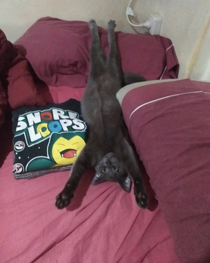

# TP0-CV

Hola mi nombre <strong>Alejandro Augusto Arce</strong>(Si la triple A), tengo 35 años y en estos momentos estoy cursando la tecnicatura en <em>Programación Informática</em>, con el objetivo de meterme mas en el mundo de la programación, especializarme mas en el back-end y en un futuro poder participar en proyectos de videojuegos. Aparte de todo esto, tambien necesito tener buenos ingresos para poder mantener a mi gata Momo que es muy <strong>demandante</strong>.

Adjunto imagen de la culpable de todo.

<h2> Programador Rookie </h2>

<ol>
<li>Assembler</li>
<li>C</li>
<li>Python</li>
<li>Pseint(?)</li>
</ol>

<h2>Lista de juegos:</h2>
<ol>
<li>Deus Ex: Human Revolution</li>
<li>Deus Ex: Mankind Divided</li>
<li>Final Fantasy (todos)</li>
<li>Elden Ring</li>
<li>Dark souls saga</li>
<li>Ni no Kuni saga</li>
<li>World of Warcraft/Warcraft I/II/III</li>
<li>Cualquier juego SoulsLike o RPG (mas si es de Squarenix)
</ol>

